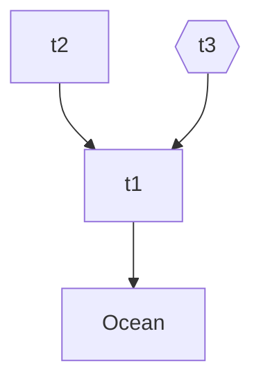
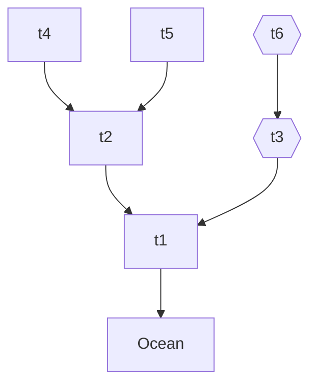
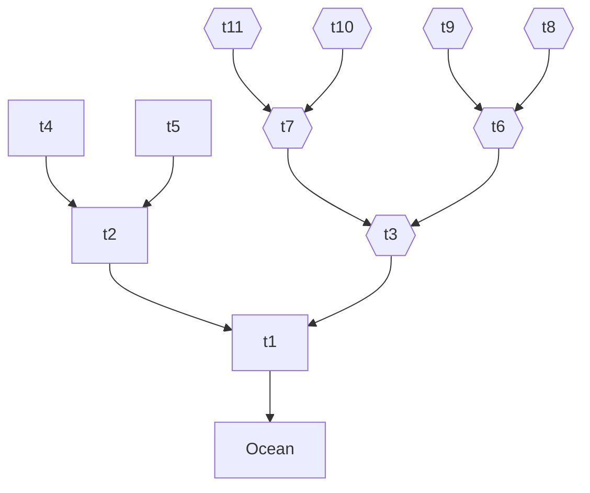

# Modified Reservoir

Based on Reservoir domain, with the following modifications:
- Each reservoir level can vary just between 0 and 100;
- Each release action is restricted between 0 and 30;
- Reservoirs just receive penalties due to overflows

## Small instance

This domain has the following topology, with hexagon nodes representing reservoirs with low amount of rain:

## Medium instance

## Large instance

