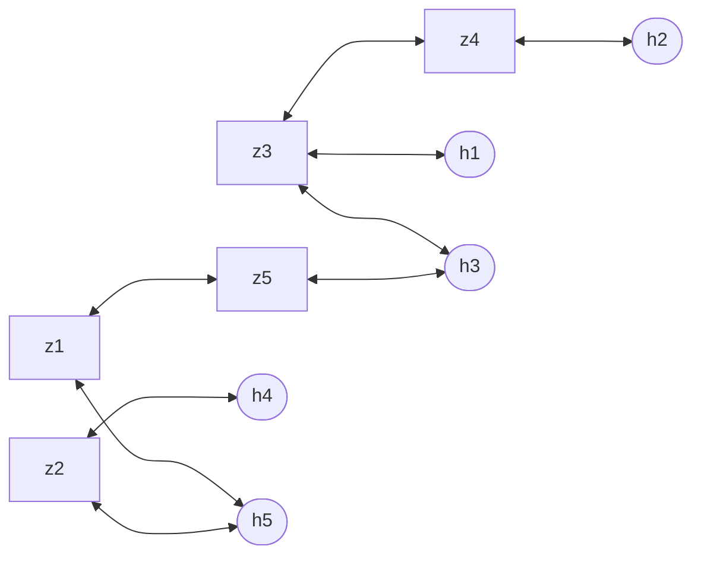

```mermaid
graph LR
    z1
    z2
    z3
    z4
    z5
    h1([h1])
    h2([h2])
    h3([h3])
    h4([h4])
    h5([h5])

    z5 <---> h3
    z3 <---> h3
    z3 <---> h1
    z4 <---> h2
    z2 <---> h5
    z2 <---> h4
    z1 <---> h5

    z3 <---> z4
    z1 <---> z5
```